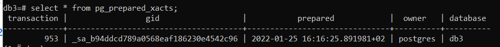

# 2pc_manager

## Protocol

1. Create 3 databases with the following command in the terminal
```
$ createdb db1
$ createdb db2
$ createdb db3
```
2. Login to databases and execute scripts for tables creation (See the tables_sql folder).  
  
  **db1** - has _**'fly'**_ table   
  **db2** - has _**'hotel'**_ table  
  **db3** - has _**'account'**_ table  
  
3. Login to db3 and insert a record into _**'account'**_ table, so that we can update it's _amount_ field.
```
INSERT INTO account VALUES ('123N', 'Nik', '200');
```
4. Run the `2pc.py` script. See that _**'fly'**_ and _**'hotel'**_ are populated and the  _**'account'**_  updated, when the transaction is sucessful.
5. Modify the `manager.py` file to test the blocked transaction.

